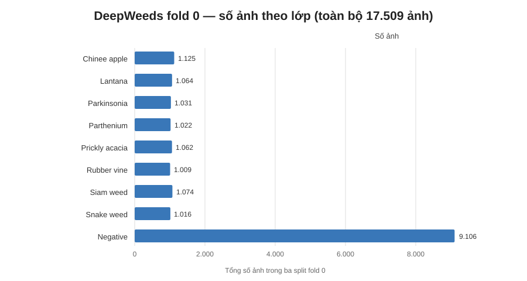

# Báo cáo Lab Day 2 — DeepWeeds

**Sinh viên:** Đào Thị Huyền

**MSSV:** 2020602670

**Bài toán:** Phân loại 9 lớp trên DeepWeeds
**Phạm vi số liệu:** fold 0; log cấu hình/lịch sử và kết quả đánh giá được sao lưu trong `logs/`, file dự đoán trong `predictions/`.

> Báo cáo phân biệt rõ số liệu đã có trong log với hạng mục chưa được chạy/lưu. Không dùng số từ bài báo tham khảo làm kết quả thực nghiệm. Các bảng chi tiết và các file dự đoán/đường cong được lưu kèm trong thư mục bài nộp.

## 1. Tóm tắt

Đã chạy 5 backbone sàng lọc (mỗi backbone 1 seed, 3 epoch), 4 biến thể công thức huấn luyện (mỗi biến thể 1 seed, 3 epoch) và một nhóm `F01`/`T00` ba seed. Trong các lần sàng, ConvNeXt-Tiny (`B05`) đạt macro-F1 validation cao nhất **0,9246** và top-1 validation **94,23%**. Tuy nhiên, không có dự đoán test của `B05`; do đó không thể báo cáo đây là cấu hình thắng chung cuộc trên test.

Kết quả test được lưu dưới tên `F01` đạt top-1 **84,23% ± 0,47 điểm phần trăm**, macro-F1 **0,7861 ± 0,0053**, ECE **0,0154 ± 0,0069** (3 seed, độ lệch chuẩn mẫu). Các file dự đoán `F01` và `T00` giống hệt nhau theo từng seed, nên không có bằng chứng về mức cải thiện test của `F01` so với mốc `T00`. Vì vậy, kết quả này chỉ được xem là kết quả test thực có của bộ dự đoán ResNet18 1-view; chưa xác nhận được một cấu hình cuối khác biệt và tốt hơn.

## 2. Dữ liệu và thiết lập

### 2.1 Kiểm tra dữ liệu

Đếm trực tiếp các CSV fold 0 và đối chiếu danh sách tên ảnh trong thư mục `output/data/images`:

| Tập | Số ảnh | Chinee apple | Lantana | Parkinsonia | Parthenium | Prickly acacia | Rubber vine | Siam weed | Snake weed | Negative |
|---|---:|---:|---:|---:|---:|---:|---:|---:|---:|---:|
| Train | 10.501 | 674 | 638 | 618 | 613 | 637 | 605 | 644 | 609 | 5.463 |
| Validation | 3.501 | 225 | 213 | 206 | 204 | 212 | 202 | 215 | 203 | 1.821 |
| Test | 3.507 | 226 | 213 | 207 | 205 | 213 | 202 | 215 | 204 | 1.822 |

Ba tập không giao nhau theo `Filename`; hợp của ba tập có **17.509** ảnh; toàn bộ tên ảnh trong ba CSV đều tồn tại trong thư mục ảnh. Tỉ lệ lớp lớn nhất/nhỏ nhất trong toàn bộ dữ liệu là `Negative`/`Rubber vine` = **9.106/1.009 ≈ 9,02**. `Negative` chiếm khoảng 52% dữ liệu, nên accuracy đơn lẻ không phản ánh đầy đủ hiệu quả trên các loài cỏ.

Các phép đếm trên xác nhận số lượng theo lớp khớp tổng số trong bảng dữ liệu của bài lab. Biểu đồ phân bố được tạo từ các số đếm này; báo cáo chưa có ảnh mẫu và bằng chứng lưu lại về việc xem ảnh sau augmentation, nên các mục đó không được xem là đã hoàn tất.

### 2.2 Thiết lập huấn luyện được lưu

- Chia dữ liệu: fold 0 cố định; không gộp validation vào train.
- Đầu vào: 224 × 224; batch size 32; mỗi thí nghiệm sàng `B01`–`B05` và `T01`–`T04` chạy 3 epoch. `F01`/`T00` chạy 6 epoch.
- Backbone fine-tune: `timm.create_model(..., pretrained=True)`; `T01` dùng khởi tạo từ đầu. Tên/tag phiên bản cụ thể của trọng số pretrained và phiên bản thư viện không được ghi vào `config.json`.
- Cấu hình ghi trong code/log: AdamW, LR backbone 1e-4, LR head 1e-3, weight decay 0,05, AMP bật, warmup 1 epoch và lịch cosine; batch size 32.
- Seed sàng: 0. Seed nhóm `F01`/`T00`: 0, 1, 2.
- Phần cứng/GPU, phiên bản Python/PyTorch/timm và thời gian chạy đầy đủ của nhóm `F01`/`T00` không có trong output đã lưu.

## 3. So sánh backbone

Tất cả hàng dưới đây là kết quả validation tốt nhất theo log, mỗi backbone một seed, 3 epoch. Thời gian trong log là tổng thời gian chạy của từng lần, không phải độ trễ suy luận.

| exp_id | Backbone | Params (M) | GMAC | Epoch tốt nhất | Macro-F1 val | Top-1 val | Thời gian train (s) |
|---|---|---:|---:|---:|---:|---:|---:|
| B01 | ResNet-18 | 11,181 | 3,627 | 3 | 0,6921 | 78,15% | 87,96 |
| B02 | ResNet-50 | 23,526 | 8,174 | 3 | 0,7001 | 78,61% | 161,16 |
| B03 | EfficientNet-B0 | 4,019 | 0,769 | 3 | 0,8628 | 89,77% | 129,40 |
| B04 | MobileNetV3 Large 1.0 | 4,214 | 0,431 | 3 | 0,8805 | 91,12% | 103,10 |
| B05 | ConvNeXt-Tiny | 27,827 | 0,638 | 3 | **0,9246** | **94,23%** | 205,83 |

`B05` có F1 validation tốt nhất trong nhóm đã chạy, còn `B04` có số tham số và GMAC thấp hơn đáng kể. Mỗi backbone chỉ có một seed và ba epoch, nên đây là kết quả sàng lọc, không phải so sánh đủ độ ổn định. Nhóm có ResNet và ConvNeXt nhưng **chưa có Transformer**; chưa đạt đủ các họ kiến trúc được khuyến nghị trong rubric. Kết quả test của `B05` không có trong output, vì vậy không ngoại suy chỉ số validation thành chỉ số test.

## 4. Ablation công thức huấn luyện

Các thí nghiệm `T01`–`T04` dùng ResNet18, seed 0 và 3 epoch. Để so sánh cùng ngân sách epoch, Δ dưới đây so với `T00` tại epoch 3 (macro-F1 validation 0,7497), không so với checkpoint 6 epoch của `T00`.

| exp_id | Thay đổi so với baseline | Macro-F1 val tốt nhất | Top-1 val | Δ macro-F1 so với T00 epoch 3 |
|---|---|---:|---:|---:|
| T00 | Fine-tune + basic augmentation + CE (epoch 3) | 0,7497 | 84,26% | — |
| T01 | Khởi tạo từ đầu | 0,3885 | 60,67% | -0,3611 |
| T02 | Augmentation `color` | 0,6713 | 76,81% | -0,0784 |
| T03 | Label smoothing 0,1 | 0,6953 | 78,61% | -0,0543 |
| T04 | Focal loss (gamma 2) | 0,7088 | 78,78% | -0,0409 |

Trong các lần chạy ngắn này, fine-tune pretrained tốt hơn khởi tạo từ đầu; các biến thể `color`, label smoothing và focal loss đều chưa vượt baseline ở epoch tương ứng. Không thể kết luận các kỹ thuật này kém trong mọi điều kiện: mỗi biến thể chỉ chạy một seed và ba epoch, và chưa có nhiều seed để ước lượng nhiễu. Chưa có thí nghiệm tổ hợp nhiều thay đổi để đánh giá hiệu ứng cộng dồn/triệt tiêu.

## 5. Suy luận và độ trễ

Output hiện lưu được mốc suy luận 1-view (`I00`/center crop theo pipeline). Không tìm thấy kết quả cho TTA lật, multi-crop/scale, ensemble, dò độ phân giải, gộp BatchNorm hay benchmark độ trễ p50/p95/p99. Cũng không có log khớp temperature trên validation.

ECE test chưa hiệu chuẩn của nhóm dự đoán là **0,0154 ± 0,0069**. Do không có ECE sau temperature scaling hoặc nhiệt độ `T`, không thể kết luận hiệu chuẩn được cải thiện. Do không có phép đo độ trễ cùng GPU/batch/dtype, không thể khẳng định cấu hình nào đạt ngân sách 30–100 ms/khung hoặc phù hợp thời gian thực. `B04` là ứng viên nhẹ theo params/GMAC để đo tiếp, không phải kết luận về độ trễ.

## 6. Kết quả test và phân tích lỗi

### 6.1 Kết quả tổng hợp

| Nhóm file | Seed | Top-1 test | Macro-F1 test | Balanced accuracy | ECE | NLL |
|---|---|---:|---:|---:|---:|---:|
| F01 | 0 | 84,72% | 0,7918 | 0,7630 | 0,0102 | 0,4426 |
| F01 | 1 | 83,78% | 0,7812 | 0,7272 | 0,0232 | 0,4702 |
| F01 | 2 | 84,20% | 0,7854 | 0,7402 | 0,0128 | 0,4562 |
| **F01 mean ± std** | **3 seed** | **84,23% ± 0,47 điểm %** | **0,7861 ± 0,0053** | **0,7435 ± 0,0181** | **0,0154 ± 0,0069** | **0,4564 ± 0,0138** |

`F01` được cấu hình trong log là ResNet18 fine-tune, basic augmentation, CE, 224 × 224, batch 32, AMP, sáu epoch. Tuy vậy, `T00` có cùng cấu hình ghi nhận được và các file dự đoán `F01`/`T00` khớp byte-for-byte cho cả ba seed ở validation lẫn test. Do đó Δ test quan sát được so với `T00` là **0**, không phải bằng chứng về một cải thiện độc lập. Ngoài ra, nhóm `B05` đạt validation cao hơn nhưng không có dự đoán test. Cần giữ nguyên hai sự kiện này khi diễn giải kết quả.

### 6.2 Chỉ số theo lớp

Trung bình và độ lệch chuẩn mẫu qua ba seed:

| Lớp | Số ảnh test/seed | Precision | Recall | F1 |
|---|---:|---:|---:|---:|
| Chinee apple | 226 | 0,7647 ± 0,0378 | 0,5664 ± 0,0290 | 0,6502 ± 0,0235 |
| Lantana | 213 | 0,9093 ± 0,0330 | 0,7261 ± 0,0178 | 0,8070 ± 0,0059 |
| Parkinsonia | 207 | 0,9020 ± 0,0245 | 0,8631 ± 0,0393 | 0,8814 ± 0,0097 |
| Parthenium | 205 | 0,8236 ± 0,0527 | 0,6780 ± 0,0417 | 0,7419 ± 0,0101 |
| Prickly acacia | 213 | 0,8262 ± 0,0411 | 0,7637 ± 0,0136 | 0,7931 ± 0,0123 |
| Rubber vine | 202 | 0,8657 ± 0,0167 | 0,8168 ± 0,0131 | 0,8404 ± 0,0047 |
| Siam weed | 215 | 0,8970 ± 0,0095 | 0,8093 ± 0,0047 | 0,8509 ± 0,0061 |
| Snake weed | 204 | 0,7825 ± 0,0176 | 0,5082 ± 0,0374 | 0,6153 ± 0,0222 |
| Negative | 1.822 | 0,8385 ± 0,0216 | 0,9596 ± 0,0110 | 0,8948 ± 0,0075 |

Hai lớp có recall thấp nhất là Snake weed (50,82%) và Chinee apple (56,64%). Ma trận nhầm lẫn cộng gộp ba seed cho thấy Chinee apple bị đoán thành Negative 216 lần và Snake weed thành Negative 183 lần. Nhầm lẫn trực tiếp Chinee apple → Snake weed là 43 lần; Snake weed → Chinee apple là 76 lần. Đây là số đếm gộp qua ba seed, nên mỗi ảnh test góp mặt một lần trên mỗi seed.

Các lỗi trên gợi ý mô hình thường bỏ sót lớp hiếm và chọn lớp Negative áp đảo. Chinee apple và Snake weed cũng nhầm trực tiếp với nhau, nhưng báo cáo không có bộ ảnh lỗi đã được kiểm tra thủ công; giả thuyết về độ giống hình thái/đặc trưng nền cần được xác minh bằng việc xem ảnh.

Ma trận nhầm lẫn cộng gộp ba seed (`F01`; số hàng/cột theo thứ tự class bên dưới):

| Nhãn thật \ Dự đoán | Chinee apple | Lantana | Parkinsonia | Parthenium | Prickly acacia | Rubber vine | Siam weed | Snake weed | Negative |
|---|---:|---:|---:|---:|---:|---:|---:|---:|---:|
| Chinee apple | 384 | 10 | 1 | 22 | 0 | 2 | 0 | 43 | 216 |
| Lantana | 9 | 464 | 0 | 1 | 0 | 6 | 16 | 15 | 128 |
| Parkinsonia | 3 | 0 | 536 | 7 | 24 | 0 | 0 | 1 | 50 |
| Parthenium | 1 | 1 | 9 | 417 | 28 | 9 | 0 | 0 | 150 |
| Prickly acacia | 3 | 0 | 34 | 24 | 488 | 2 | 0 | 0 | 88 |
| Rubber vine | 0 | 1 | 0 | 2 | 0 | 495 | 3 | 7 | 98 |
| Siam weed | 0 | 17 | 0 | 0 | 0 | 2 | 522 | 3 | 101 |
| Snake weed | 76 | 10 | 0 | 12 | 4 | 8 | 8 | 311 | 183 |
| Negative | 27 | 8 | 15 | 24 | 48 | 48 | 33 | 18 | 5.245 |

## 7. Kết luận và giới hạn

1. **Tốt nhất theo validation:** `B05` ConvNeXt-Tiny, macro-F1 0,9246/top-1 94,23%, seed 0, ba epoch. Chưa có test nên chưa thể gọi là cấu hình tốt nhất cuối cùng.
2. **Kết quả test thực có:** dự đoán `F01`/`T00` ResNet18 1-view, top-1 84,23% ± 0,47 điểm phần trăm, macro-F1 0,7861 ± 0,0053. Hai nhóm file test trùng nhau, nên mức cải thiện quan sát được của `F01` so với `T00` bằng 0.
3. Trong thí nghiệm sàng backbone, khác biệt kiến trúc đi cùng khác biệt về số tham số/chi phí và chỉ có một seed; chưa đủ bằng chứng tách riêng đóng góp của backbone khỏi nhiễu. Ablation công thức huấn luyện chưa vượt baseline trong ngân sách 3 epoch. Phần suy luận nâng cao chưa được đo, nên không thể so sánh định lượng ba nhóm đóng góp.
4. Kết quả dựa trên một fold, có 3 seed cho nhóm dự đoán cuối nhưng mới 1 seed cho sàng backbone/ablation. Split ngẫu nhiên không theo địa điểm có thể làm kết quả lạc quan khi triển khai sang địa điểm, mùa hoặc điều kiện ánh sáng khác.
5. Các mục chưa có bằng chứng trong output: Transformer; so sánh inference ngoài 1-view; latency p50/p95/p99; temperature scaling; kiểm tra loss ban đầu/overfit một batch; xem ảnh mẫu/lỗi; metadata GPU và phiên bản thư viện; dự đoán test của `B05`. Không suy diễn hoặc điền số cho các mục này.

## 8. Phụ lục: thí nghiệm và đầu ra

- Backbone: `B01`–`B05`; công thức: `T00`–`T04`; nhóm nhiều seed: `F01` và `T00`.
- Log cấu hình/lịch sử: `logs/<exp_id>/seed<k>/`; JSON/CSV đánh giá: `logs/eval_out/`.
- Dự đoán và biểu đồ: `predictions/` và `curves/`.
- Notebook bài làm: `code/lab_day2.ipynb`. Notebook hiện không có liên kết Colab/Kaggle công khai đi kèm; hướng dẫn tái lập cục bộ nằm trong README bài nộp.
